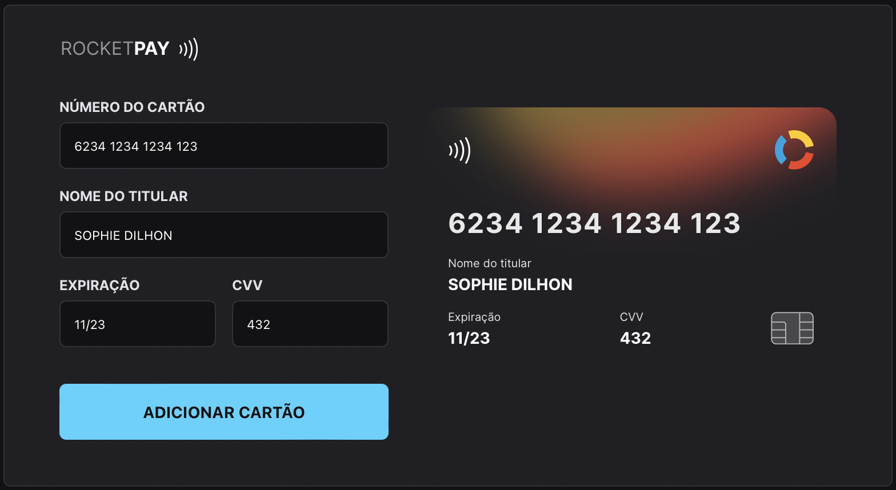

<h1 align="center"> Explorer Lab #01 </h1>

Event promoted by <a href='https://www.rocketseat.com.br'>RocketSeat</a> to teach Web technologies.

  <a href="#-technologies">Technologies</a>&nbsp;&nbsp;&nbsp;|&nbsp;&nbsp;&nbsp;
  <a href="#-project">Project</a>&nbsp;&nbsp;&nbsp;|&nbsp;&nbsp;&nbsp;
  <a href="#-layout">Layout</a>&nbsp;&nbsp;&nbsp;|&nbsp;&nbsp;&nbsp;

  

 

  

## 🚀 Technologies

This project was developed using the following technologies:

- HTML e CSS
- JavaScript e JSON
- [Node e NPM](https://nodejs.org/)
- [Vite](https://vitejs.dev/)
- [iMask](https://imask.js.org)

## 💻 Project

RocketPay simulates a credit card form, containing input masks and updating the card image based on its number.
The following cards are available, with their respectives number pattern:

`Elo`: starts with the number 6 (6000 0000 0000)

`Visa`: starts with the number 4 (4000 0000 0000)

`MasterCard`: starts with 5 followed by a digit in the range 1-5 (5109)

  

The project is deployed at [rocket-pay-nine.vercel.app](http://rocket-pay-nine.vercel.app/).

## 🔖 Layout

The project mockup is avaible at [figma](https://www.figma.com/file/gpqavL469k0pPUGOmAQEM9/Explorer-Lab-%2301/duplicate).
